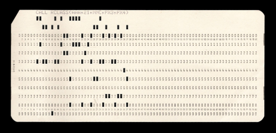
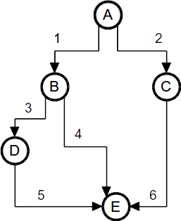
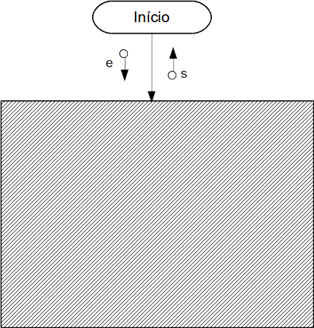
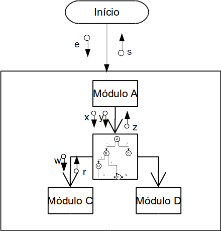

# Papo sobre software, com quem entende!

(c) 2018 [**Cleuton Sampaio**](https://github.com/cleuton).

# Falando sobre testes…
**Cleuton Sampaio** 

Você fez certo o software? Você fez o software certo? Percebeu a sutiliza da diferença entre essas duas perguntas? 

- *Fazer certo o software:* O produto de trabalho funciona, apresentando os resultados esperados;
- *Fazer o software certo:* O produto de trabalho faz o que foi pedido;

Este jogo de palavras serve para demonstrar que o assunto “teste” é mais complexo do que se imagina… 

## Segregação de testes

As pessoas testam software, sempre o fizeram e sempre o farão. O que muda é a maneira como testamos. Nos anos 70, separávamos uma parte do arquivo (geralmente em fita magnética) para servir como casos de teste. Chamávamos isso de “massa de teste”. 

A mesma “massa de teste” era utilizada por muito tempo. Meses e até anos a fio, testando com os mesmos dados. O teste nada mais era do que executar o software com aqueles dados e ver se o resultado foi o mesmo. 

Não raro, tínhamos que “consertar” a “massa de teste” para atender às nossas especificações. E era comum alguns programadores manterem dados de teste na forma de cartões perfurados, dentro de suas gavetas, para poderem testar aquilo que lhes interessava.

(foto: Wikimedia commons - Mutatis mutandis)

Quem testava era o próprio programador, que também avaliava o resultado do teste. Ele era o responsável por executar a alteração, criar os dados de teste, executar o teste, avaliar o teste e liberar o software para “produção”. 

Simplesmente, não havia o conceito de “segregação”. 

O teste feito pelo programador visava avaliar se ele havia implementado corretamente a alteração no código-fonte. Só isso. E, geralmente, a “massa de teste” era “maceteada” por ele. 

Quando o software passou a ser online, utilizando algum tipo de terminal de usuário, o problema se acentuou muito. Além de manter “arquivos de teste”, ou seja, o conjunto de dados em disco que o software acessaria ou atualizaria, o programador também deveria testar manualmente as interações via terminal, executando os caminhos necessários para avaliar o software.

Foi nessa época que o conceito de segregação de teste surgiu. Primeiro, segregaram a função de teste, que passou a ser feita por outras pessoas, diferentes daquelas que programaram o software (“quem faz, não testa”). É claro que o programador continuou a testar o software, mas agora, havia outra pessoa, com objetivo diferente, avaliando o software. 

O programador verifica se o seu próprio trabalho foi feito de maneira correta. O testador verifica se o software todo está funcionando de maneira correta. E erros podem acontecer, mesmo que os testes do programador estejam corretos. Um tipo de erro é o de “Falha em compatibilidade retroativa”: 

“Backward compatibility is a property of a system, product, or technology that allows for interoperability with an older legacy system, or with input designed for such a system, especially in telecommunications and computing. Backward compatibility is sometimes also called downward compatibility.

Modifying a system in a way that does not allow backward compatibility is sometimes called "breaking" backward compatibility” - Wikipedia

(“Compatibilidade retroativa é uma propriedade de um sistema, produto ou tecnologia, que permite interoperabilidade com um sistema legado, ou com entradas criadas para tal sistema, especialmente em telecomunicações e computação. Compatibilidade retroativa é  chamada às vezes de compatibilidade “downward”.

Modificar um sistema de maneira que não permita a compatibilidade retroativa é às vezes conhecido como “quebrar” a compatibilidade retroativa.”)

Ao modificar um software, um programador pode provocar falhas em transações que já funcionavam, ou pode invalidar correções que já haviam sido feitas, causando o surgimento de novos ou velhos problemas. 

Para evitar este problema, os projetistas e testadores escreviam cenários de teste, cada um partindo de uma situação hipotética, com vários casos de teste ou “test scripts” a serem executados, geralmente de forma manual.

## Cobertura e integração

Estas primeiras tentativas de segregação de testes foram proveitosas, mas, por serem “externas” ainda padeciam de alguns problemas. 

O primeiro deles é: 

*Como garantir que a maior parte do código, incluindo desvios, tenha sido testado?*

Isso se chama de “cobertura de teste” ou “cobertura de código” (test coverage / code coverage): 

“In computer science, test coverage is a measure used to describe the degree to which the source code of a program is executed when a particular test suite runs. A program with high test coverage, measured as a percentage, has had more of its source code executed during testing, which suggests it has a lower chance of containing undetected software bugs compared to a program with low test coverage” - Wikipedia

(“Em ciência da computação, cobertura de teste é a métrica utilizada para descrever o grau em que o código-fonte de um programa é executado, quando um conjunto particular de teste é rodado. Um programa com alta cobertura de teste, medida como percentual, tem mais do seu código-fonte executado durante o teste, o que sugere que ele tenha menor chance de conter bugs de software não detectados, se comparado com um programa com baixa cobertura de teste”)

Se enxergarmos o código-fonte de um programa como um grafo, podemos identificar vários caminhos possíveis para a execução de um teste.

Se imaginarmos que cada nó seja uma instrução, podemos notar que existem vários caminhos (arestas) e que, dependendo das condições presentes no teste, a execução pode seguir um ou outro caminho. O ideal é criarmos testes que exercitem TODOS os caminhos do código-fonte. 

Um software é composto por várias “partes” ou “módulos”. Estes módulos foram desenvolvidos e mantidos por pessoas diferentes. Quando adicionamos (ou modificamos) um destes módulos, surge o segundo problema dos testes “externos”:

*Como garantir que cada parte do software esteja se integrando corretamente com as outras?*

Eu prefiro chamar as partes de um software de “módulos”, em vez de “componentes”, pois é uma denominação menos comprometida com implementações. 

Entendemos cada módulo como um pedaço semi independente do software. São partes que precisam trabalhar em sinergia para que o software funcione. Portanto, os módulos possuem integrações entre si.

Alguns chamam essas integrações de “interfaces”, porém, como eu já disse, prefiro denominações menos comprometidas, e “interfaces” pode dar a ideia de que estou falando de software construído com o paradigma OOP (Orientado a Objetos), o que não é verdade. O que estou falando se aplica a qualquer tipo de paradigma de programação.

Vamos a um pequeno exemplo…

Na figura anterior, o “Módulo A” invoca o “Módulo B”, passando para ele os parâmetros “x” e “y”, e recebendo o parâmetro “z” como resposta. O “Módulo B”, por sua vez, invoca os módulos “C” e “D”, passando e recebendo parâmetros. Estas são as integrações do software. Não podemos simplesmente conectar o “Módulo A” ao “Módulo C” porque suas integrações são diferentes. 

Ao invocar o “Módulo B”, o “Módulo A” espera um resultado determinado. Ao ser invocado, o “Módulo B” espera alguns parâmetros determinados. Um erro nos parâmetros de entrada ou de retorno, pode provocar erros em um ou nos dois módulos. 

Vamos supor que você modificou o código do “Módulo C”, portanto, pode afetar a integração com os módulos “B” e “A”. 

Estes são os erros de integração. 

Conforme vamos desenvolvendo um software, devemos definir claramente quais são as integrações entre os módulos e os programadores devem seguir essa documentação. E, ao juntarmos os módulos para compor o software, precisamos testar se as integrações estão funcionando como deveriam.

É muito difícil fazer isso manualmente e externamente. Algumas integrações importantes podem ficar de fora do teste, causando problemas inesperados. 

## Caixa preta e caixa branca

Os testes “externos”, aqueles feitos sem conhecimento da implementação do software, também são chamados de “caixa preta”:

“Teste de caixa-preta é um teste de software para verificar a saída dos dados usando entradas de vários tipos. Tais entradas não são escolhidas conforme a estrutura do programa.” - Wikipedia

Este é o tipo de teste mais popular que existe. Munido da especificação, o Testador cria cenários e casos de teste, executando-os sem considerar mais nada, apenas os resultados esperados.

O teste “caixa preta” tem apenas o objetivo de validar o software de acordo com sua especificação: 

Fornecemos a entrada (“e”) e obtemos a saída (“s”), comparando com o resultado que esperávamos. 

Mas e se quisermos saber sobre cobertura e integração? Neste caso, temos que criar a massa e os casos de teste considerando a implementação e a estrutura dos módulos. Isto  se chama de teste “caixa branca”.

A criação de testes “caixa branca” exige ferramentas para avaliar a cobertura e executar os testes entre os módulos, simulando aqueles que não queremos testar.

## Mock

Nos testes unitários precisamos ser radicais: Só testar aquilo que for necessário. Por isto, devemos excluir tudo o que não faz parte da “unidade” que estamos testando. Uma das formas de fazer isto é simulando o comportamento de outras partes. Isto é conhecido como “mock” (imitar). 
Frameworks como [“mockito”](http://site.mockito.org/) e [“jmock”](http://jmock.org/) nos permitem simularmos outros componentes, como: Bancos de dados e regras de negócio, para focarmos apenas na unidade que desejamos testar. 

Esta é uma segregação importante, pois o teste unitário não pode e não deve depender de comportamento real de outros módulos. Deve ser possível executar e re-executar o teste unitário sem envolver outras partes do software. 

Segregação de objetivos

Podemos segregar os testes por objetivo: 

Tipo de teste | Modo de teste | Objetivo 
Unitário | Caixa branca | Testar as partes do software com o máximo de cobertura possível
Integração | Caixa branca | Testar as integrações entre os módulos, exercitando o máximo delas possível
Sistema | Caixa branca | Testar o sistema em seus limites de requisitos não funcionais, avaliando seu comportamento
Aceitação | Caixa preta | Testar a funcionalidade, de acordo com a especificação
Desempenho | Caixa preta | Testar se o sistema atente aos requisitos de desempenho
Vulnerabilidade | Caixa preta | Testar se o sistema apresenta alguma vulnerabilidade explorável

A diferença entre “teste de sistema” e “teste de desempenho” é que, no primeiro, queremos ver como o sistema se comporta, incluindo seu funcionamento interno. No segundo, queremos ver apenas os sintomas externos (tempo de resposta, consumo de recursos, consistência de dados e erros).

## Automação de testes

A complexidade dos softwares atuais dificulta muito a confecção e execução de testes manuais. Hoje em dia, com as ferramentas modernas, podemos automatizar os testes, criando scripts que são processados repetidamente.

Podemos organizar os scripts de tal forma, que sempre que precisarmos gerar uma nova versão do software, executamos todos os testes (unitários, integração, aceitação etc). 

Os testes automatizados são executados por ferramentas especiais e, para os testes “caixa branca”, temos que utilizar alguns programas especiais para implementar os scripts de teste. 

Por exemplo, no caso de Java, podemos usar o framework Junit para criar casos de teste, sejam unitários ou de integração, que podem ser executados com o uso de uma ferramenta de “build” de software, como o [Maven](http://www.obomprogramador.com/2014/06/curso-maven-pro-licao-1-odeio-maven.html). 

Em outras plataformas, como o Frontend, podemos utilizar outras ferramentas. No caso do React, por exemplo, utilizamos o [Jest](https://facebook.github.io/jest/) para criarmos casos de teste para nossos componentes visuais. Na verdade, eu demonstrei isso no exemplo do [ReactDontPanic](http://reactdontpanic.com/fontes/).

Com o uso de softwares como o [Jenkins](https://jenkins.io/), podemos automatizar toda a integração e testes do nosso software, gerando versões executáveis e relatórios completos de análise de código. 

O objetivo deste artigo não é entrar em detalhes muito técnicos, porém, se quiser ver um projeto completo, com testes unitários e de integração em Java, sugiro dar uma olhada no meu projeto [Jqana](https://github.com/cleuton/jqana). Veja o código-fonte dentro da pasta “./src/test/java” temos todo o código de teste unitário, e na pasta “jqana/src/it/first-it/verify.bsh” temos um script “beanshell” para o teste de integração. 

## É isso ai

Bem, com esse *papo* descontraído, espero ter mostrado a você a importância dos testes. Mas, o que talvez, não tenha se dado conta é que os **testes são pagos pelo Cliente e a ele pertencem**. Sim, código de teste é parte do produto e deve ser mantido e entregue sempre. 

